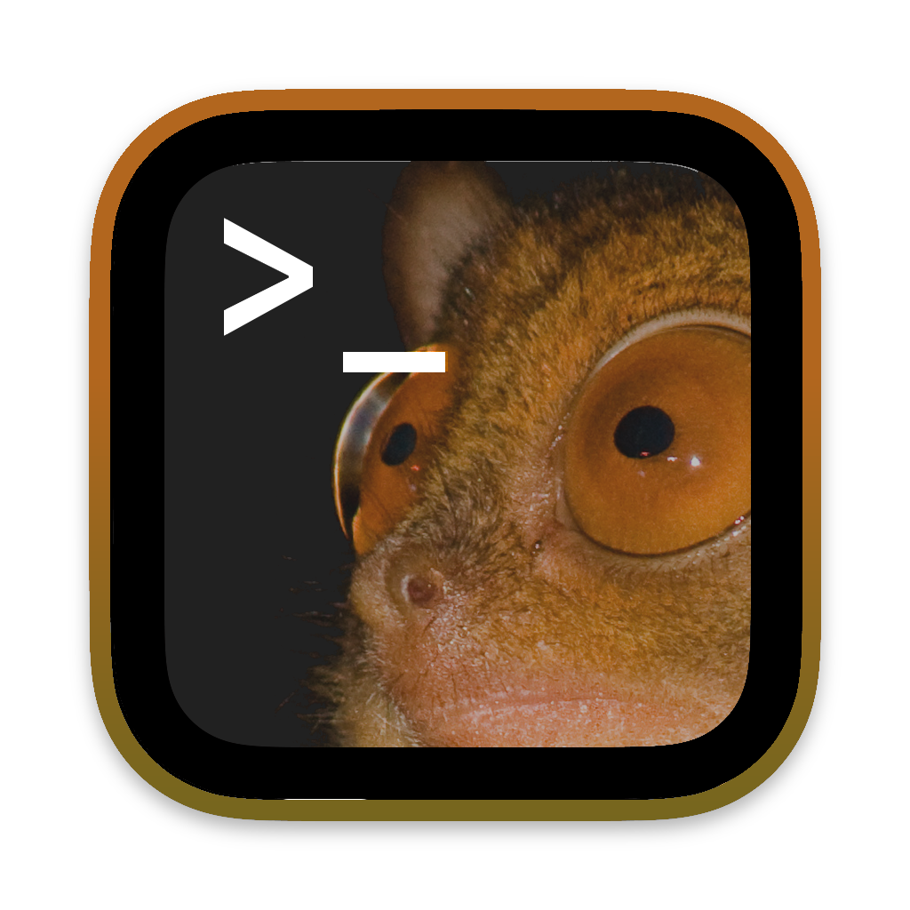

# Tarsier terminal emulator

Programming books never talk about graphic design.

## Development status

You can spawn a window that get keypresses and send it to a virtual terminal
that is displayed on your terminal. The emulated terminal have the size of the
text that fit in the window. The window font path, size and spacing can be
changed in settings.hcf. I have to find a good solution to store and display
stuff in the window. 
